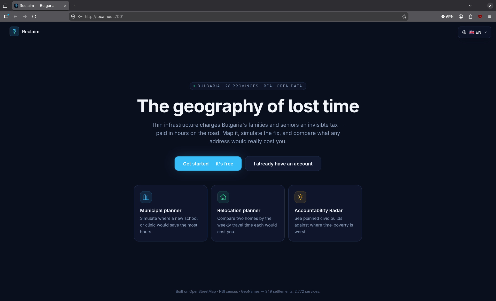
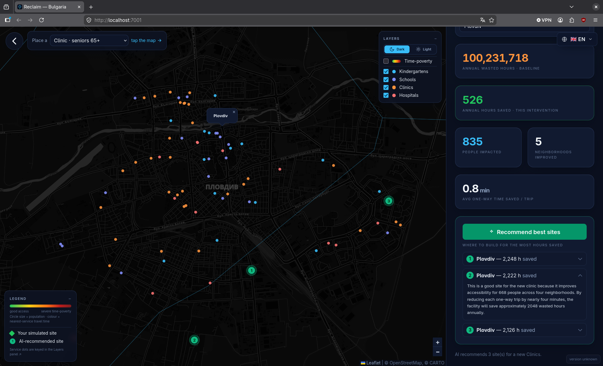
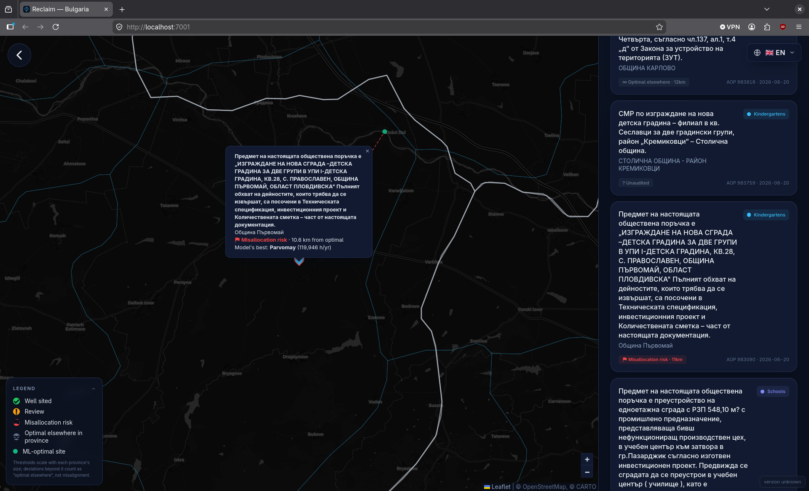
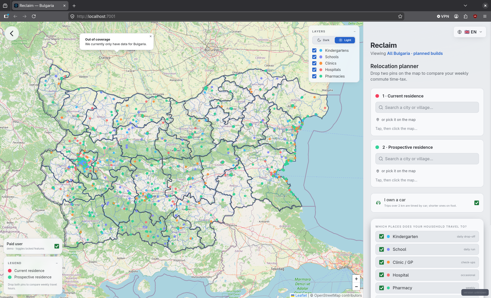
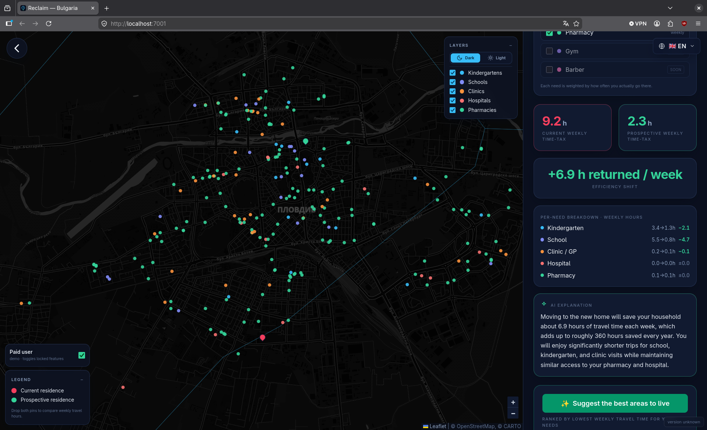
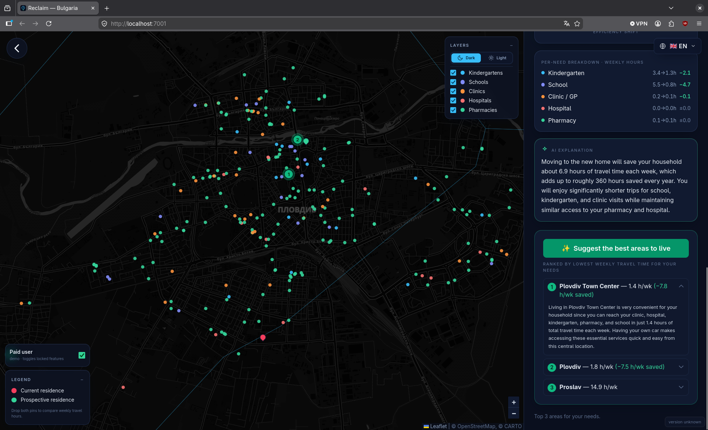

<h1 align="center">⏳ Reclaim — <em>The Geography of Lost Time</em></h1>

<p align="center">
  <strong>An open-source platform that measures the invisible "time tax" infrastructure gaps impose on vulnerable people — and uses a two-stage ML pipeline to recommend where to build next.</strong>
</p>

<p align="center">
  <a href="#overview">Overview</a> •
  <a href="#features">Features</a> •
  <a href="#screenshots">Screenshots</a> •
  <a href="#technical-architecture">Architecture</a> •
  <a href="#tech-stack">Tech Stack</a> •
  <a href="#quick-start">Quick Start</a> •
  <a href="#configuration">Configuration</a> •
  <a href="#retraining-the-models">Retraining</a> •
  <a href="#security">Security</a> •
  <a href="#contributing">Contributing</a>
</p>

<p align="center">
  
  
  
  
  
  
  
  
  
  
</p>

---

<p align="center">
  
  &nbsp;
  
  &nbsp;
  
</p>

<p align="center">
  🏆 <strong>3rd place — Mentor's Choice, ZaraHack 2026.</strong> &nbsp;·&nbsp; The technical mentors praised the two-stage ML architecture (HGBR + XGBoost).
</p>

---

## Overview

A clinic that is *technically available* in the next town is not available in any
practical sense to a 70-year-old without a car, or to a parent doing a daily
kindergarten run. The cost of that gap is paid in **time** — hours per year spent
travelling to services others reach in minutes. That recurring, compounding,
unequally-distributed cost is what Reclaim calls the **time tax**.

Reclaim quantifies it from **real open data** (OpenStreetMap + national census +
GeoNames) and renders it on an interactive map. The reference deployment covers all
**28 provinces of Bulgaria** (2,772 supply nodes, 14,476 demand cells, **≈ 334
million wasted hours/year**) — but nothing about the region is hard-coded: point it
at a [region config](config/region.example.yaml) and it runs for your own country.

It measures the two cohorts whose mobility is most constrained:

| Cohort | Services | Trips / yr |
| :--- | :--- | :---: |
| 👶 **Children 0–6** | kindergartens, schools | 180 |
| 👴 **Seniors 65+** | clinics, hospitals, pharmacies | 24 |

---

## Features

<table width="100%">
  <tr>
    <td width="50%" valign="top">
      <h3>🏛 Municipal Optimization</h3>
      See systemic time-loss across a province as a choropleth. <strong>Click the map</strong> to simulate building a facility and watch the annual "wasted hours saved" update live — or press <strong>AI: Recommend best sites</strong> to have the trained placement model propose the highest-impact locations.
    </td>
    <td width="50%" valign="top">
      <h3>🏠 Personal Relocation Planner</h3>
      Drop two pins — current vs. prospective home — and compare your household's weekly commute time-tax between them, broken down by the services you actually use. An AI write-up explains what the numbers mean.
    </td>
  </tr>
  <tr>
    <td width="50%" valign="top">
      <h3>📡 Accountability Radar</h3>
      Planned civic builds scraped from the public-procurement registry (AOP), each <strong>audited against the model's best site within its own local neighbourhood</strong> — so a planned kindergarten is judged on whether a better spot exists <em>nearby</em>, not somewhere across the province.
    </td>
    <td width="50%" valign="top">
      <h3>🤖 Two-Stage ML Pipeline</h3>
      A <strong>HistGradientBoosting</strong> model learns real transit time from distance; an <strong>XGBoost</strong> surrogate distills the placement simulation so thousands of candidate sites can be ranked in milliseconds. Both are location-free and generalize across regions.
    </td>
  </tr>
  <tr>
    <td width="50%" valign="top">
      <h3>🔐 Role-Based Access</h3>
      A login gate fronts the app; each account sees only the lens its role allows — <code>FREE_USER</code> → <code>PAID_USER</code> → <code>REPORTER</code> → <code>MUNICIPALITY</code>, plus a seeded admin with a user-management panel. JWT auth, bcrypt-style hashing, rate limiting.
    </td>
    <td width="50%" valign="top">
      <h3>🌐 Bilingual Interface (BG / EN)</h3>
      The entire UI is available in Bulgarian (default) and English via a lightweight i18n layer, plus a <strong>Dark</strong> ("AI") theme and a <strong>Maps</strong> (light) theme that re-skins both the chrome and the basemap tiles.
    </td>
  </tr>
</table>

---

## Screenshots

<p align="center">
  
</p>

| 🏛 Municipal — AI site recommendations | 📡 Accountability Radar |
| :---: | :---: |
|  |  |
| **🏠 Personal planner — light theme** | **🌙 Personal planner — dark theme** |
|  |  |

<p align="center">
  
  <br><em>Personal planner — AI relocation suggestions</em>
</p>

---

## Technical Architecture

### The dual-model ML pipeline

The headline of the project is a **two-stage pipeline** — each stage a different
model chosen for the job it does.

```
 datasets/  (OSM .pbf · census .xlsx · GeoNames)
     │
     ▼  data extraction + fusion  (ml-service/dataload.py)
 settlement demand cells  +  service supply nodes
     │
     ├────────────────────────── STAGE 1 ──────────────────────────┐
     ▼                                                              │
 HistGradientBoostingRegressor  →  traveltime.pkl                   │
   features: [haversine_km, is_urban, dest_density]                 │
   target:   real driving minutes (OpenRouteService, or a           │
             physics speed-curve when no API key)                   │
   monotonic in distance · R² ≈ 0.95 · MAE ≈ 7 min                  │
     │                                                              │
     ▼  converts any distance → realistic minutes                   │
     ├────────────────────────── STAGE 2 ──────────────────────────┘
     ▼
 XGBoost placement surrogate  →  placement_<group>.pkl
   • sweep a grid of candidate build-sites through the (vectorized)
     simulation → "annual hours saved" labels
   • train a surrogate on cheap, location-free features so thousands
     of candidates can be scored instantly
   features: demand_5km, demand_15km, dist_nearest_service_km,
             addressable_hours_10km/25km, mean_baseline_min_15km
   R² ≈ 0.87 (children) / 0.85 (seniors)
     │
     ▼
 GET /api/ml/recommend  →  top-N highest-impact sites
```

**Why two stages.** Travel time is a smooth, monotonic physical relationship —
HistGradientBoosting learns it cheaply and we constrain it to be non-decreasing in
distance. Site selection is a combinatorial *optimization* over that learned
surface; rather than re-run an expensive simulation per candidate at request time,
Stage 2 distills the simulation into an XGBoost surrogate that ranks candidates in
milliseconds. The models are **location-free and baseline-aware** — they learn from
*how much currently-wasted travel time is reachable near a candidate*, not from raw
coordinates, so they generalize across regions instead of memorizing geography.

### System shape

Everything runs **locally**, as four cooperating services:

| Component | Stack | Port | Role |
| :--- | :--- | :---: | :--- |
| `backend-api` | Java 25 / Spring Boot 4.1 | `:8080` | REST API, auth/roles, the wasted-hours math |
| `ml-service` | Python / FastAPI | `:8000` | the two models above, served from a cached bundle |
| `frontend` | Tailwind + Leaflet | `:7001` | the map UI and the three lenses |
| `data-engine` | Python ETL | — | one-time extract + seed into PostgreSQL |

See [`docs/architecture.md`](docs/architecture.md) for request flows and why there
are two backends.

---

## Tech Stack

| Layer | Technology | Purpose |
| :--- | :--- | :--- |
| API backend | Java 25 · Spring Boot 4.1 | REST API, JWT auth, role gating, scoring math |
| ML service | Python 3.11 · FastAPI · Uvicorn | model training + inference sidecar |
| Transit model | scikit-learn `HistGradientBoostingRegressor` | learned travel-time (monotonic in distance) |
| Placement model | XGBoost (sklearn fallback) | hours-saved surrogate for site ranking |
| Geospatial ETL | osmium · pandas · openpyxl | OSM / census / GeoNames extraction + fusion |
| Frontend | Vanilla JS · Tailwind CSS 3.4 · Leaflet | map UI, dual themes, i18n (BG/EN) |
| Database | PostgreSQL 14+ | demand cells, supply nodes, users, AI cache |
| Routing labels | OpenRouteService API (optional) | real driving-time training labels |
| Config | YAML region config | single source of region truth (no hard-coding) |

---

## Quick Start

### Prerequisites

- **Java 25+**, **Python 3.11+**, **Node 18+**, **PostgreSQL 14+**
- The raw datasets for your region (OSM `.pbf`, census spreadsheet, GeoNames dump) — see [`docs/datasets.md`](docs/datasets.md)

### 1 — Clone and configure

```bash
git clone https://github.com/ivkirov/kernel-zarahack.git
cd kernel-zarahack
cp .env.example .env                       # DB creds, admin login, JWT secret
cp config/region.example.yaml config/region.yaml
```

### 2 — Database + data engine (one-time seed)

```bash
createdb timepoverty                       # or your configured PGDATABASE
cd data-engine
python3 -m venv venv && source venv/bin/activate
pip install -r requirements.txt
set -a; source ../.env; set +a
python run_pipeline.py                      # extract OSM/census + seed PostgreSQL
```

### 3 — ML service (`:8000`)

```bash
cd ml-service
python3 -m venv venv && source venv/bin/activate
pip install -r requirements.txt
python ../scripts/retrain.py                # build caches + train both models
uvicorn app:app --port 8000
```

### 4 — Backend API (`:8080`)

```bash
cd backend-api
set -a; source ../.env; set +a
mvn spring-boot:run
```

### 5 — Frontend (`:7001`)

```bash
cd frontend
npm install
npm run build:css
npm run serve                               # → http://localhost:7001
```

> Full walkthrough + troubleshooting: [`docs/getting-started.md`](docs/getting-started.md).

---

## Configuration

### Region — run it for your own country

All region-specific knowledge — bounding box, dataset filenames, the province
crosswalk, the amenity→cohort map, demographic age bands — lives in **one file**:
[`config/region.example.yaml`](config/region.example.yaml). Nothing is hard-coded in
source.

```bash
cp config/region.example.yaml config/region.yaml
# edit: name, country_code, bbox, dataset filenames, provinces, amenity_map, age bands …
```

Drop the raw files into `datasets/` under the names you listed, then re-run the
pipeline. Override the config path anywhere with `REGION_CONFIG=/path/to/region.yaml`.

> **Note.** The census parser targets the Bulgarian NSI spreadsheet layout; a
> differently-shaped census sheet needs a small adapter (see [`docs/datasets.md`](docs/datasets.md)).
> The map overlays in `frontend/data/` are likewise region-specific GeoJSON.

### Environment variables

Copy `.env.example` to `.env` and fill in the values.

| Variable | Required | Description |
| :--- | :---: | :--- |
| `PGHOST` / `PGPORT` / `PGDATABASE` / `PGUSER` / `PGPASSWORD` | ✅ | PostgreSQL connection |
| `APP_AUTH_JWT_SECRET` | ✅ (prod) | JWT signing key, ≥ 32 chars. Unset ⇒ random per boot. |
| `APP_ADMIN_EMAIL` / `APP_ADMIN_PASSWORD` | — | Seeded admin. Unset password ⇒ random, logged once at first boot. |
| `REGION_CONFIG` | — | Path to a region YAML (default: `config/region.yaml`). |
| `ORS_API_KEY` | — | OpenRouteService key for real driving-time training labels. |
| `GEMINI_API_KEY` | — | Google Gemini key for AI explanations (blank ⇒ deterministic fallback). |

```bash
openssl rand -base64 48   # generate APP_AUTH_JWT_SECRET
```

> ⚠️ **Never commit your `.env`.** It is already in `.gitignore`; `.env.example` holds
> only placeholders and is safe to commit.

---

## Retraining the models

The whole ML pipeline has a single entry point, driven by the region config — from
data extraction to the final `.pkl` files:

```bash
# default: config/region.yaml, one placement model per demand group
python scripts/retrain.py

# explicit config / pick the amenities to model / reuse caches
python scripts/retrain.py --config config/region.yaml --amenities kindergarten,clinic
python scripts/retrain.py --skip-extract

# real driving-time labels instead of the synthetic speed curve
ORS_API_KEY=<openrouteservice key> python scripts/retrain.py
```

It runs **extract → traveltime (HGBR) → placement (XGBoost, per group)** and reports
the artifacts written to `ml-service/models/`. Component detail:
[`ml-service/README.md`](ml-service/README.md).

---

## Security

| Principle | Implementation |
| :--- | :--- |
| Authentication | JWT tokens, signed with a configurable secret (`APP_AUTH_JWT_SECRET`). |
| Secrets as config | Admin credentials and JWT key are **never** in source — env-only. |
| Role enforcement | Every gated endpoint resolves the current user and rejects unauthorized roles. |
| Rate limiting | Login and other sensitive routes are throttled to resist brute-force. |
| Cache-key bounding | District inputs are canonicalized to a fixed key space (anti memory-DoS). |
| Security headers | CSP, `X-Frame-Options`, `X-Content-Type-Options`, etc. set on responses. |
| Input validation | Server-side validation on every request body. |

Full threat model, the OWASP review + fixes, and the production hardening checklist
live in [`SECURITY.md`](SECURITY.md).

---

## Documentation

The README is the entry point; the depth lives in [`docs/`](docs/).

| Doc | Contents |
| :--- | :--- |
| [Overview](docs/overview.md) | What the project is, who it measures, what it produces |
| [Architecture](docs/architecture.md) | System shape, request flows, why two backends, repo map |
| [Getting Started](docs/getting-started.md) | Prerequisites, setup, using the app, troubleshooting |
| [Methodology](docs/methodology.md) | Cohorts, travel model, every scoring formula, assumptions |
| [Datasets](docs/datasets.md) | OSM / census / GeoNames sources, the fusion, the crosswalk |
| [Data Pipeline](docs/data-pipeline.md) | The `data-engine` ETL steps + the PostgreSQL schema |
| [Backend API](docs/backend-api.md) | Java/Spring internals, config, the math methods |
| [ML Service](docs/ml-service.md) | The two model families, features, training, inference |
| [Frontend](docs/frontend.md) | Leaflet UI, mode routing, layers, caching, motion |
| [API Reference](docs/api-reference.md) | Every endpoint with request/response shapes + curl |
| [Security](SECURITY.md) | Threat model, OWASP review + fixes, hardening checklist |

---

## Recognition

<p align="center">
  🏆 <strong>3rd place — Mentor's Choice category, <a href="https://zarahack.com">ZaraHack 2026</a></strong>
</p>

The technical mentors specifically praised the architecture — the two-stage ML
pipeline (HistGradientBoosting for transit time, XGBoost for spatial optimization)
described in [Technical Architecture](#technical-architecture).

---

## Contributing

Contributions are welcome. Please open an issue before submitting a pull request for
significant changes.

```bash
# Fork and clone
git clone https://github.com/<your-fork>/kernel-zarahack.git

# Create a feature branch
git checkout -b feat/your-feature-name

# Make changes, then commit following Conventional Commits
git commit -m "feat: add transit isochrones to the municipal lens"

# Push and open a PR against master
git push origin feat/your-feature-name
```

**Commit convention:** `feat:` · `fix:` · `refactor:` · `docs:` · `chore:` · `test:`

---

## License

Distributed under the **GNU General Public License v3.0**. See [`LICENSE`](./LICENSE)
for the full text. Copyright © 2026 The Reclaim authors.

> **OpenKBS** (`openkbs.json`, `functions/`, `site/`) is a dev playground only —
> nothing is deployed there. The whole stack runs on your machine.

---

<p align="center">Made with ❤️ in Bulgaria — to give people back their time.</p>

<p align="center">
  <a href="https://github.com/ivkirov/kernel-zarahack">⭐ Star this repo</a> •
  <a href="https://github.com/ivkirov/kernel-zarahack/issues/new">🐛 Report a Bug</a> •
  <a href="https://github.com/ivkirov/kernel-zarahack/issues/new">✨ Request a Feature</a>
</p>
